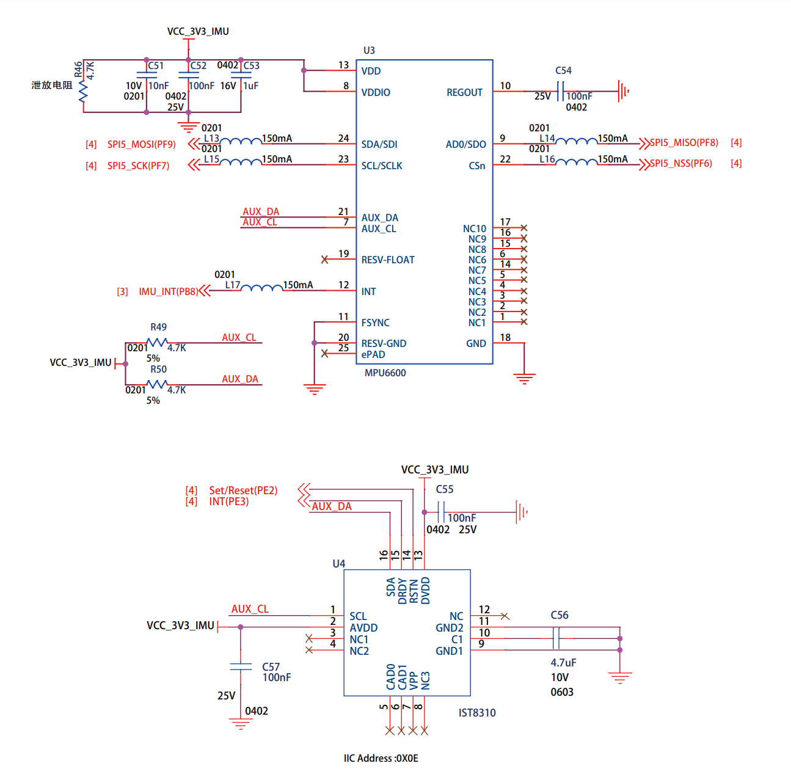
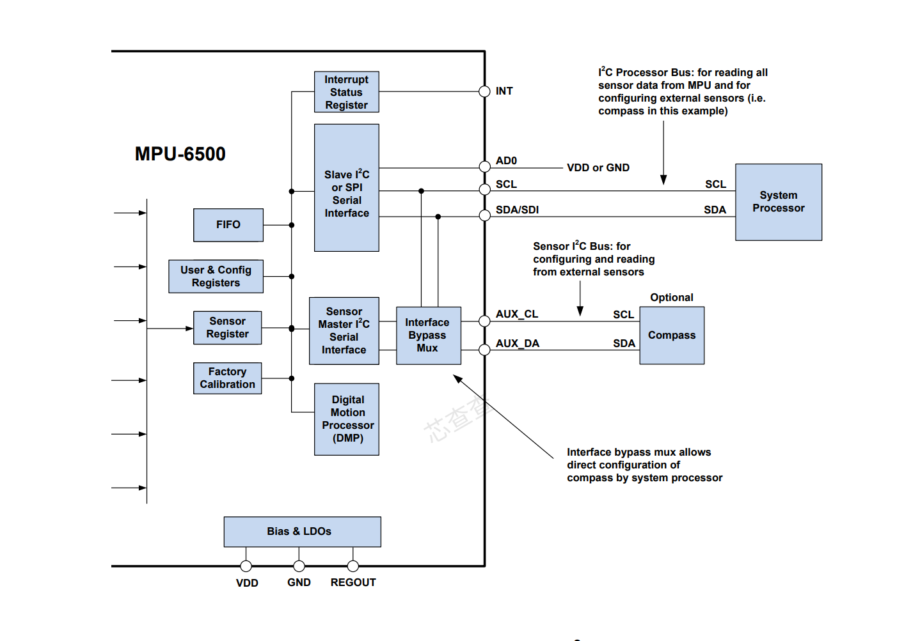
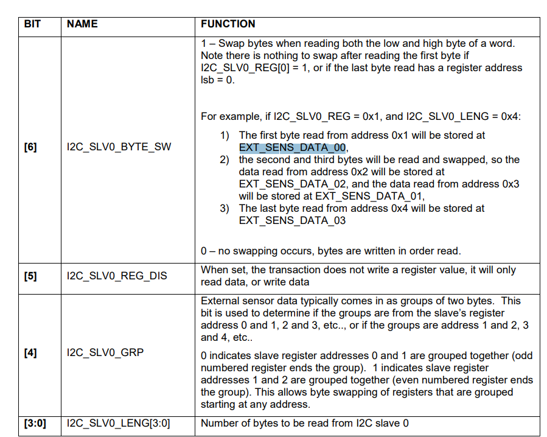
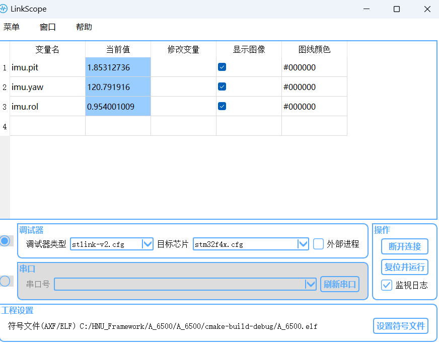
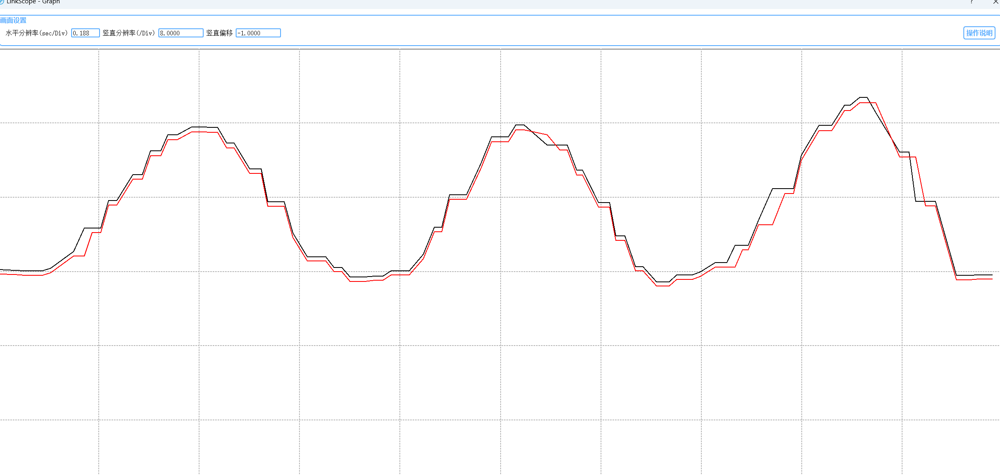

## About task4
### 任务四读取robomasterA开发板中的mpu6500模块和ist8310模块



首先要根据A型开发板的原理图配置CubeMX的引脚,由图可知配置SPI5,PF6脚电平高低,决定片选,低电平为选择片选,高电平为关闭片选.

由原理图可知Mpu6500又作为I2c主机连接从设备ist8310,接下来要通过寄存器手册,通过两个读写函数进行mpu6500的寄存器配置
```c
uint8_t mpu_write_byte(uint8_t const reg, uint8_t const data)
{
    DEVIICE_SPI5_ENABLE();
    tx = reg & 0x7F;
    HAL_SPI_TransmitReceive(&MPU_HSPI, &tx, &rx, 1, 55);
    tx = data;
    HAL_SPI_TransmitReceive(&MPU_HSPI, &tx, &rx, 1, 55);
    DEVIICE_SPI5_DISABLE();
    return 0;
}


uint8_t mpu_read_byte(uint8_t const reg)
{
    DEVIICE_SPI5_ENABLE();
    tx = reg | 0x80;
    HAL_SPI_TransmitReceive(&MPU_HSPI, &tx, &rx, 1, 55);
    HAL_SPI_TransmitReceive(&MPU_HSPI, &tx, &rx, 1, 55);
    DEVIICE_SPI5_DISABLE();
    return rx;
}
```
通过这两个最基础的读写函数进行mpu6500的初始化,然后进行数据的读取

当然除此之外还需要通过相关寄存器设置加速度计量程和陀螺仪的量程

再读取到数据后要进行高低位的数据移位拼接组成16位的原始数据,之后要根据加速度和陀螺仪的量程对其读出的原始数据单位进行转换以方便之后的姿态角解算



由mpu6500官方文档我们可知mpu6500可以作为I2c主机最多连接4个从机,这里我们需要做的是通过读写mpu6500寄存器使其打开Master主机模式,操作slave0->slve4进行ist8310磁力计原始数据的读取

读取的过程也是以mpu6500对ist8310读函数和对ist8310的写函数为基础,进行ist8310的初始化,再进行值的读取




最终读取出的数据会存在寄存器EXT_SENS_DATA_XX中

<font color=green>**问题** :起始mpu6500作为i2c主机读取ist830过程很抽象,slave0-4轮番对ist8310进行操作,一会是从机0对ist8310进行写操作,而读出的数据又存在从机4相应寄存器中,而我们反观上面的视图,slave应该是mpu6500作为从设备和mcu通信用的,而与ist8310通信用的因该是Aux_cl和Aux_Da这两条辅助引脚,但这种读取操作Aux_cl和Aux_Da因该是上面引脚的辅助,至于具体的操作流程官方文档也并未说明</font>


### 接下来进行九轴四元数姿态角解算
要在运算前进行单位的转变,四元数解算看了解算教程,说实话确实比较难理解,这个代码是网上找到的,根据程序魔改了一下,比较好的一点是四元数解算和更新都在一个函数内部完成,比其他的自称飞控代码,解算一大堆结果结果不准,延时还比较高,可能是我没有看到很好的**Mahony算法**大疆官方代码解算不准可能是因为根据磁力计的值给的相应四元数不对
```c
//加速度单位g，陀螺仪rad/s
void IMUupdate1(float gx, float gy, float gz, float ax, float ay, float az, float mx, float my, float mz)
{


    float norm;
    float vx, vy, vz;
    float ex, ey, ez;

    float hx, hy, hz, bx, bz;
    float wx, wy, wz;
    float  halfT;


    now_update  = HAL_GetTick(); //运行时间ms
    halfT       = ((float)(now_update - last_update) / 2000.0f);
    last_update = now_update;


    // 测量正常化,把加计的三维向量转成单位向量。
    norm = sqrt(ax*ax + ay*ay + az*az);
    ax = ax / norm;                   //单位化
    ay = ay / norm;
    az = az / norm;

    norm = sqrt(mx*mx + my*my + mz*mz);
    mx = mx / norm;
    my = my / norm;
    mz = mz / norm;
    // 这里计算得到的是地磁计在理论地磁坐标系下的机体上三个轴的分量
    hx = 2*mx*(0.5 - q2*q2 - q3*q3) + 2*my*(q1*q2 - q0*q3) + 2*mz*(q1*q3 + q0*q2);
    hy = 2*mx*(q1*q2 + q0*q3) + 2*my*(0.5 - q1*q1 - q3*q3) + 2*mz*(q2*q3 - q0*q1);
    hz = 2*mx*(q1*q3 - q0*q2) + 2*my*(q2*q3 + q0*q1) + 2*mz*(0.5 - q1*q1 - q2*q2);


    //bx计算的是当前航向角和磁北的夹角，也就是北天东坐标下的航向角
    //当罗盘水平旋转的时候，航向角在0-360之间变化
    bx = sqrt((hx*hx) + (hy*hy));
    bz = hz;

    //地磁计在n系下磁向量转换到b系下，反向使用DCM得到
    wx = 2*bx*(0.5 - q2*q2 - q3*q3) + 2*bz*(q1*q3 - q0*q2);
    wy = 2*bx*(q1*q2 - q0*q3) + 2*bz*(q0*q1 + q2*q3);
    wz = 2*bx*(q0*q2 + q1*q3) + 2*bz*(0.5 - q1*q1 - q2*q2);

    // 估计方向的重力,世界坐标系重力分向量是通过方向旋转矩阵的最后一列的三个元素乘上加速度就可以算出机体坐标系中的重力向量。
    vx = 2*(q1*q3 - q0*q2);//由下向上方向的加速度在加速度计X分量
    vy = 2*(q0*q1 + q2*q3);//由下向上方向的加速度在加速度计X分量
    vz = q0*q0 - q1*q1 - q2*q2 + q3*q3;//由下向上方向的加速度在加速度计Z分量


//这个叉积向量仍旧是位于机体坐标系上的，而陀螺积分误差也是在机体坐标系，而且叉积的大小与陀螺积分误差成正比，正好拿来纠正陀螺。
//（你可以自己拿东西想象一下）由于陀螺是对机体直接积分，所以对陀螺的纠正量会直接体现在对机体坐标系的纠正。

//                ex = (ay*vz - az*vy);
//        ey = (az*vx - ax*vz);
//        ez = (ax*vy - ay*vx);
    ex = (ay*vz - az*vy) + (my*wz - mz*wy);
    ey = (az*vx - ax*vz) + (mz*wx - mx*wz);
    ez = (ax*vy - ay*vx) + (mx*wy - my*wx);


    // 积分误差比例积分增益,计算陀螺仪测量的重力向量与估计方向的重力向量之间的误差。
//        exInt = exInt + ex*Ki;
//        eyInt = eyInt + ey*Ki;
//        ezInt = ezInt + ez*Ki;
    /* PI */
    if(ex != 0.0f && ey != 0.0f && ez != 0.0f)
    {
        exInt = exInt + ex*Ki*halfT;
        eyInt = eyInt + ey*Ki*halfT;
        ezInt = ezInt + ez*Ki*halfT;

        // 调整后的陀螺仪测量,使用叉积误差来进行比例-积分（PI）修正陀螺仪的零偏。将修正量乘以比例增益Kp，并加上之前计算的积分误差exInt、eyInt和ezInt。
        gx = gx + Kp*ex + exInt;
        gy = gy + Kp*ey + eyInt;
        gz = gz + Kp*ez + ezInt;
    }
    // 整合四元数率和正常化,根据陀螺仪的测量值和比例-积分修正值，对四元数进行更新。根据微分方程的离散化形式，将四元数的每个分量加上相应的微分项乘以采样周期的一半（halfT）。
    q0 = q0 + (-q1*gx - q2*gy - q3*gz)*halfT;
    q1 = q1 + (q0*gx + q2*gz - q3*gy)*halfT;
    q2 = q2 + (q0*gy - q1*gz + q3*gx)*halfT;
    q3 = q3 + (q0*gz + q1*gy - q2*gx)*halfT;

    // 正常化四元数
    norm = sqrt(q0*q0 + q1*q1 + q2*q2 + q3*q3);
    q0 = q0 / norm;
    q1 = q1 / norm;
    q2 = q2 / norm;
    q3 = q3 / norm;


    imu.pit  = asin(2 * q2 * q3 + 2 * q0* q1)* 57.3; // pitch ,转换为度数
    imu.rol = atan2(-2 * q1 * q3 + 2 * q0 * q2, q0*q0-q1*q1-q2*q2+q3*q3)* 57.3; // rollv
    imu.yaw = atan2(2*(q1*q2 - q0*q3),q0*q0-q1*q1+q2*q2-q3*q3) * 57.3;

    imu.pit0 =  KalmanFilter(imu.pit,10.0,0.05);
    imu.rol0 =  KalmanFilter(imu.rol,10.0,0.05);
    imu.yaw0 =  KalmanFilter(imu.yaw,10.0,0.05);//最简单的一阶卡尔曼滤波,Q,R值没调的很好

}
```
测试结果正常,响应速度较快



### 比较头疼的是卡尔曼滤波,好在一阶滤波搞懂五个公式就行


- <font color=white>x 最优估计;p 协方差;K 卡尔曼增益;F 状态转移矩阵;
Q 过程激励噪声;</font>


- <font color = "brown">可以由图中的关于卡尔曼增益的式子看出k越大表示越信任观测量,k越小表示越信任最优估计量.即Q越小,R越小时,k越小,越不依赖观测值;Q越大k越大越信任观测值</font>

- <font color=green>R值为测量噪声,R太大卡尔曼滤波相应会变慢,因为对新的测量量信任度会变低.R越小,系统收敛速度越快,但过小容易出现震荡.
- 调试时可将Q从小往大调,将R从大往小调整;先固定一个值再去调整另外一个值,看收敛速度和波形输出</font>
 
#### 虽然加入了卡尔曼滤波,但是效果不明显(还是有一点用的,从波形来看在数据波动时,加了滤波的波动不明显,收敛也要快一点)




<font color="#dc143c">

- 红的(滤过)</font>

- 黑的(没滤)

## <font color=pink>问题:
- 对于卡尔曼滤波我还是只用了最初级的一阶滤波,至于华南小虎队里讲的根据不同模型进行建模,对特定模型进行特定滤波,还有高阶卡尔曼滤波还没尝试.

- 可能还是值没有调好,代码里用的卡尔曼滤波效果并没有那么好
